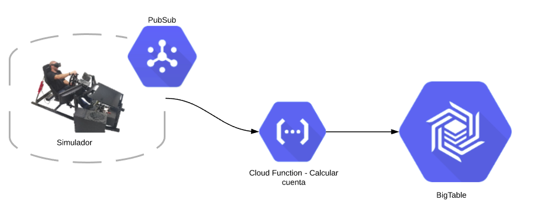
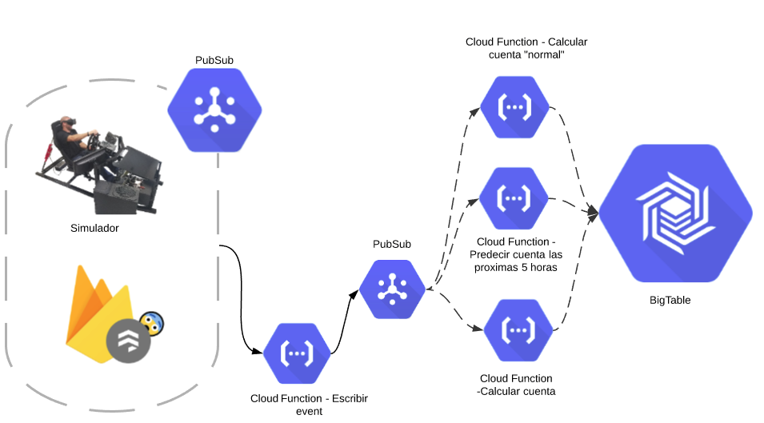
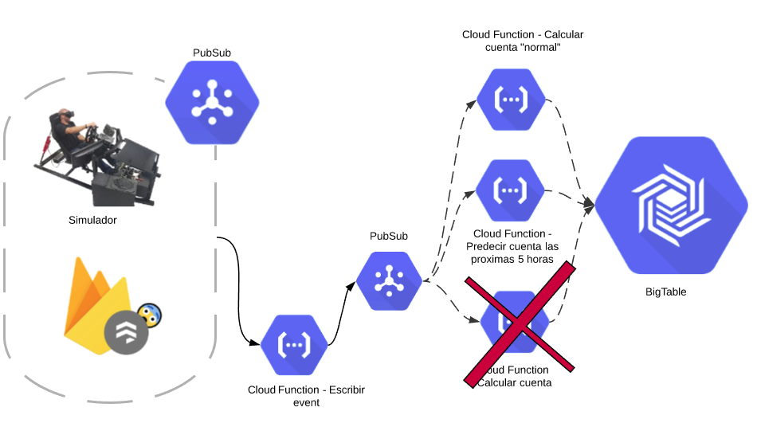
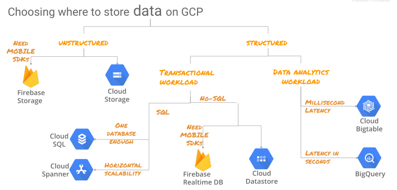

# ETL Pipeline - PubSub/BigTable


This is an expermental/example pipeline for backend data migration of event data to a long-term (performance ) database.
The objectives of this project are to:

  - Demonistrate the ingestion of event data via PubSub
  - Utilize basic read/write funcionalities in BigTable
  - Establish that such a pipeline can be used to deliver real-time analytics effectivly
  - Demonistrate the use of "infrustructure as code" by utilizing Serverless Framework
  - Create a functioning simulator to be used in testing 
  - **TODO:** Build integrated CI with unit and end-to-end testing (utlizing the simulator)

## Getting Started

This service utilizes the Serverless Framework setup for resource management. For comprehensive information vist the [info](https://serverless.com/framework/docs/providers/google/) page.

TLDR version:

### Initial Deployment
1) Install serverless and verify
```sh
npm install -g serverless
serverless --version
```
2) Install the GCP plugin
```sh
npm install --save serverless-google-cloudfunctions
```
3) Download [credential files](https://serverless.com/framework/docs/providers/google/guide/credentials/) and place them in your home directory with the naming convention of "~/PROJECT_NAME.json"
4) Deploy service 
         Note: STAGE_NAME can be: ['dev', 'test', 'prod']

```sh
sls deploy --stage STAGE_NAME --project PROJECT_NAME
Note: --stage and --project are optional parameters
```

### Updating Service / Redeploy
After changes have been made to the service an "update" can be preformed to deploy those changes to the cloud. To preform the update run the same deployment command as before (and the Serverless Framework will handle the rest).

```sh
sls deploy --stage STAGE_NAME --project PROJECT_NAME
Note: --stage and --project are optional parameters
```
A service update has two key charristics:
1) Data in the DataBase (BigTable) will not be deleted
2) It will (generally) be faster than a full deployment

### Deleting/Removing Service
If a service needs to be removed use the following command:
```sh
sls remove
```
**WARNING:** Removing a service will delete everything in the databases (BigTable)

### Resetting DB/ Removing Data from Tables
While most data stores allow for deletion of data on an entry by entry basis, the fastest way to ```drop``` a table from BigTable is to remove the service and redeploy it. 
```sh
sls remove && sls deploy
```

**WARNING:** This will remove **ALL** the tables and data from BigTable


## Running the Simulator
After deploying the service the simulator can be run at anytime inside the dev and test enviorments. **The simulator can not be run in the production enviorment**
The ```simulateAccesoData``` function is tied to an http trigger. To begin the simulation run the following command from the terminal.
```sh
curl --header "Content-Type: application/json" \
  --request POST \
  --data '{"limit": 10, "speedFactor": 120}' \
  https://us-central1-empack-238417.cloudfunctions.net/simulateAccesoData_dev 
```
**NOTE:** The above example runs in the ```dev``` enviorment inside the project ```empack-238417``` in the region ```us-central1```. To modify any of these variables see the framework below:
```sh
curl --header "Content-Type: application/json" \
  --request POST \
  --data '{"limit": NUMER_OF_EVENTS, "speedFactor": VELOCITY_OF_SIMULATION, "project": PROJECT_NAME}' \
  https://REGION-PROJECT_NAME.cloudfunctions.net/simulateAccesoData_STAGE_NAME 
```
**NOTE:** The above example runs in the ```dev``` enviorment inside the project ```empack-238417``` in the region ```us-central1```. To modify any of these variables see the framework below:
```sh
curl --header "Content-Type: application/json" \
  --request POST \
  --data '{"limit": NUMER_OF_EVENTS, "speedFactor": VELOCITY_OF_SIMULATION, "project": PROJECT_NAME}' \
  https://REGION-PROJECT_NAME.cloudfunctions.net/simulateAccesoData_STAGE_NAME 
```


## Pipeline Definition

The current pipeline setup is as seen below:


Looking forward, future architectures could include:


**Why the are the ```Escribir Event``` and ```Calcular Cuenta``` functions together in the Current pipeline but seperated in the Going Forward version?**
* Seperating them allows for a "Fan-out" to be applied to all calculations done for the service. It also allows for best fault tolerance. In the Going Forward should the ```Calcular Cuenta``` fail the event will still be writted to BigTable. In the current setup that is not guaranteed.
   
**Why use "Fan-on"? Why not run everything in one function?**
* The "Fan-out" method provides better fault tolerance. If one of the calculations fails the others will still write to BigTable.
    
    

**Why have two PubSubs? Why not attach the calculation functions to the same topic as ```Escribir Event```?**
*   Having seperated PubSub topics guarantees that the row exists in BigTable before the calculation functions attempt to write to it.


## Table Definition
### Use Cases
A BigTable pipeline is best suited for a non-transactional, High-volume data flows where access patterns are predictable.
    

The schema for the current DB is:
* InstanceId: iotincoming
    * Table: incomingraw_STAGE_NAME
        * Column: event
            * service
            * eventTime
            * event
        * Column: realTimeStatus
            * currentOccupancy
            * writeTime


## Function Definitions

###  simulateAccesoData
* **Input**: request object containing:
    *   JSON/Dict Containing:
        *   limit: Number of events to simulate
        *   speedFactor: Speed at which to run simulation. Example: 60 is an hour's worth of data in 1 minute
        *   project: Project Name (used for creating topic if non-existent)
* **Actions Executed**: 
    *  Event data published to PubSub topic 
*  **Return**:
    *  Text reporting # of events excueted
###  pubSubReciever
* **Input**: topic message from PubSub containing:
    *   JSON/Dict Containing:
        *   eventTime: timestamp for event
        *   event: The message received from IOT (1 if person entered, -1 if person exited)
        *   service: name of IOT
* **Actions Executed**: 
    *  Event data written to BigTable (event)
    *  Current count of persons in site calculated and written to BigTable (realTimeStatus)


## Troubleshooting
It's common when deploying the service to a new stage to see the following error:
```
 {"ResourceType":"gcp-types/bigtableadmin-v2:projects.instances.tables", 
 "ResourceErrorCode":"404", 
 "ResourceErrorMessage": 
        {"code":404, 
            "message":"Instance projects/empack-238417/instances/iotincoming not  found.",
            "status":"NOT_FOUND",
            "statusMessage":"Not Found",
            "requestPath":"https://bigtableadmin.googleapis.com/v2/projects/empack-238417/instances/iotincoming/tables",
            "httpMethod":"POST"}}
```

**If you navigate to the ```GCP Console > Deployment Mangement > SERVICENAME``` (in this case "etlservice") you will see a move detalled error description.**

In the case mentioned above the issues is that the BigTable instance has not finished deploying before an attempt is made to create the table. The solution is to repeate the ```sls deploy``` command.

If you execute ```sls deploy``` and encounter the following error it's because the deploy process hasn't finished for your previous execution. The solution is to wait a minute of two and try it again. 
**If you would like to monitor the progress of your deployment (to know when the service will be unlocked for a redeploy) you can access it in the console at ```GCP Console > Deployment Mangement > SERVICENAME```**
```
 Resource 'projects/empack-238417/global/deployments/sls-etlservice-dev' has an ongoing conflicting 
 operation: 'projects/empack-238417/global/operations/
 operation-1565034163266-58f63e95ce2b2-26e14098-59e4c635'.
```
